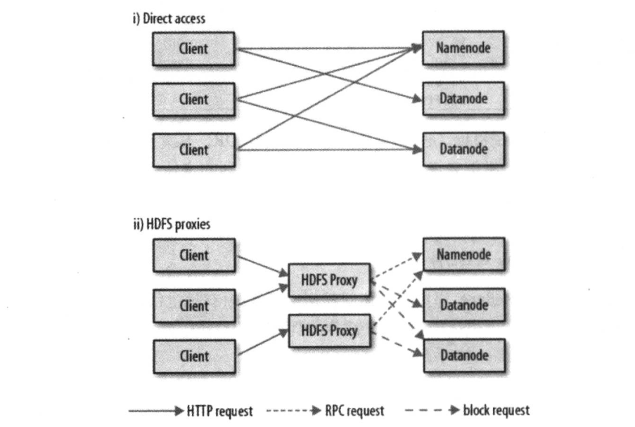

##### HDFS 适用场景

```
1. 大文件存储
2. 流式数据访问, 一次写入多次读取
3. 不适合低延迟访问
4. 不适合大量小文件, 根据经验每个元数据占150字节. 如100w个文件, 每个文件1个数据块, 需要至少300MB 内存
5. 只支持打个写入者, 以添加的方式在文件尾追加. 不支持文件任意位置修改, 不支持多个写入者.
```

##### 磁盘数据块

```
1. 磁盘块: 每个磁盘都有默认的数块大小, 这是磁盘读写的最小单位, 一般512字节
2. 文件系统块: 文件系统的块大小可以是磁盘块的整数倍, 一般几千字节
3. 构建于磁盘上的文件系统通过磁盘块管理文件系统块, 操作系统提供了 df 和 fsck 维护文件系统来对文件系统块进行操作
```

##### block 数据块

```
1. HDFS 的 block 默认 128MB
2. block 被分为 chunk 作为独立的存储单元
3. 于面向磁盘的文件系统不同的是, 文件大小小于 block 时不会占用整个块, 只占用实际的大小
4. block 比磁盘块大是为了最小化寻址时间, 当 block 足够大时, 从磁盘传输数据的时间明显大于寻址时间, 因此传输一个由多个块组成的大文件的时间取决于磁盘传输速率.
5. block 不能设的过大, MapReudce 中的 Map 通常只处理一个块中的数据, 如果相对集群节点数任务数太少, 并发效率低
6. block 大致的计算公式:
	磁盘寻址时间约 10ms, 传输速率 约100M/s, 为了使寻址时间占传输时间的 1%, 块的大小约设为 100mb
	随着磁盘传输速率的提升, block 会被设的更大
```

- block 好处

```
1. 文件的大小可以大于网络中任意一个磁盘的容量, 文件所有的块不必存储在同一个磁盘上, 可以在集群中的任意一个磁盘存储
2. 简化存储管理, 由于块的大小固定, 计算单个磁盘能存多少个块相对容易. 块存实际数据, 元数据与块分开单独存储, 元数据可以单独管理
3. 适合数据备份提高容错能力和可用性, 将块复制到物理互相独立的机器上, 默认3个, 确保机器发生故障时数据不丢失

查看 block 命令
$ hdfs fsck / -files -blocks
```

##### namenode

- 管理系统命名空间, 维护文件系统树和树内所有文件和目录
- 在系统启动时根据数据节点信息重建, 运行时会更新
- 管理调度 datanode
- 运行 namenode 的服务损坏文件系统上的所有文件将丢失, 因为不知道如何根据 datanode 重建文件
- 持久化方式: 
  - 以镜像文件保存在本地磁盘上
  - 日志文件永久保存在本地磁盘上
- 容错办法: 
  - 备份持久化的文件, 通过配置使 namenode 在多个文件系统上保存元数据, 这些操作时实时且原子性的. 一般是持久状态写入本地同时, 写入一个远程挂在的网络文件系统(NFS)
  - secondary namenode: 在另外的机器上单独运行, 需要大量 CPU 时间, 需要与 namenode 一样多的内存来执行合并操作, 并保存合并后的命名空间镜像. 辅助节点保存的数据会滞后于主节点, 可能会丢失数据. 一般把 NFS 上的 namenode 元数据复制到辅助 namenode 并作为新的 namenode 运行.

##### datanode

```
工作节点, 实际存储数据, 
定期向 namenode 发送存储的块列表
```

##### client

```
通过客户端与 namenode 和 datanode 交互
```

##### secondary namenode

```


```

##### 块缓存

```
通常 datanode 从磁盘读数据, 但访问频繁的文件其对应的块可能缓存在 datanode 的内存中, 以堆外块缓存的形式存在. 默认一个块缓存在一个 datanode 中
```

 ##### 联绑 HDFS

```
1. namenode 的内存限制了集群扩容, 联邦 HDFS 允许添加 namenode 实现扩展
2. 每个 namenode 管理命名空间的一部分.
3. 每个 namenode 维护一个命名空间卷 namespace volume, 由命名空间的元数据和一个数据块池 block pool 组成, 数据块池包含该命名空间下文件的所有块
4. 命名空间卷互相独立, 两两之间互补通信, 一个 namenode 失效也不会影响其他 namenode
5. datanode 需要注册到每个 namenode, 并且存储来自多个数据块池中的数据块
6. 访问联邦 HDFS 集群, 客户端需要使用客户端挂载数据表将文件路径映射到 namenode
```

##### 高可用

- 单点失效

  ```
  通过联合使用多个文件系统备份 namenode 的元数据和通过备用 namenode 创建监测点能防止丢数据, 但依旧存在单点失效 (SPOF, single point of failure) 问题, 如果 namenode 失效时客户端和 MapReduce 都无法使用, 因为 namenode 是唯一存储元数据与数据块映射的地方, 直到有新的 namenode 上线
  ```

- 新的 namenode 满足下面条件才能上线

  ```
  将命名空间的镜像导入内存中
  重演编辑日志
  接收到足够多来自 namenode 的数据报告推出安全模式
  (对于大型并拥有大量文件和数据块的集群, namenode 冷启动需要 30 分钟, 甚至更长)
  ```

- 实现原理

  ```
  1. 配置一对活动和备用的 active-standby namenode, 两个 namenode 之间共享存储的编辑日志, 这种共享需要高可用. 
  2. 当备用 namenode 接管工作之后, 它将读取共享的编辑日志, 直到结尾以实现与活动 namenode 状态同步, 并替代活动 namenode 写入数据.
  3. datanode 需要同时向两个 namenode 发送数据处理报告, 因为数据块的映射保存在内存中, 而不是磁盘
  4. 活动 namenode 失败后, 备用 namenode 能够快速(几十秒)实现任务接管
  5. 实际察觉失败的时间约1分钟左右, 因为系统需要保守确定活动 namenode 是否真失效
  6. HDFS URI 使用一个逻辑主机名, 该主机名映射到一对 namenode 地址, 客户端库会访问每个 namenode 直到处理完成
  ```

- 实现方式

  - NFS 过滤器
  - QJM 集群日志管理器(常用): 以一组日志节点 journal node 的形式运行, 每一次编辑必须写入多个日志节点, 系统中允许任何一个失败. 同一时间 QJM 仅允许一个 namenode 向编辑日志写入数据

- 当活动和备用都失败后, 可以再设置备用 namenode 冷启动

- 故障切换

  ```
  故障转移控制器 failover controller 管理活动 namenode 转移为备用 namenode 的过程, 
  故障转移控制器有多种, 默认 zookeeper, 确保仅有一个活动 namenode, 
  每个 namenode 都运行故障转移控制器, 通过心跳机制监视活动 namenode 是否有效, 并在 namenode 失效时切换
  ```

- 避免切换出现问题的方法

  ```
  当网速非常慢时, 可能激发故障转移, 但先前活动的 namenode 仍然在运行
  
  杀死之前运行的 namenode
  插销访问共享目录的权限
  通过远程命令屏蔽其接口
  STONITH 通过特定的供电原件使主机断电
  ```

##### HDFS 文件权限

```
r
w
x 不能在 HDFS 中执行文件, 访问子目录需要这个权限

owner 所属用户
group 所属组
mode 模式
```

##### hadoop 文件系统

- Hadoop 以 java api 形式提供文件系统访问接口. 其他语言使用 WebHDFS 提供的 http rest api 访问 HDFS. http 接口比原生的 java 客户端慢

- Hadoop 具有抽象文件系统概念, HDFS 只是其中一个实现

- java 抽象类 org.apache.hadoop.fs.FileSystem 定义了 hadoop 客户端接口, 抽象类有多种实现

  | 文件系统       | URI 方案 | java 实现                   | 说明                         |
  | -------------- | -------- | --------------------------- | ---------------------------- |
  | Local          | file     | fs.LocalFileSystem          | 使用客户端校验和本地磁盘系统 |
  | HDFS           | hdfs     | hdfs.DistributedFileSystem  | hadoop 分布式文件系统        |
  | WebHDFS        | Webhdfs  | hdfs.web.SWebHdfsFileSystem | 基于 http 的文件系统         |
  | Secure WebHDFS | swebhdfs | hdfs.web.SWebHdfsFileSystem | 基于 https 文件系统          |
  | HAR            | har      | fs.HarFileSystem            |                              |
  | View           | viewfs   | viewfs.ViewFileSystem       |                              |
  | FTP            | ftp      | fs.ftp.FTPFileSystem        | 由 FTP 支持的文件系统        |

- 命令示例

  ```bash
  # 查看本地文件系统根目录文件(查看的是这台计算机)
  $ hadoop fs -ls file:///
  ```

##### http 访问 HDFS 方式



- 直接访问, HDFS 直接处理客户端请求

  ```
  1. namenode 和 datanode 中内嵌 web 服务作为 WebHDFS 的端节点
  2. 元数据操作 namenode 处理, 文件读写 datanode 处理
  3. dfs.webhdfs.enable 默认为 true 
  ```

- 通过代理访问, 客户端常用 DistributedFileSystem api 访问 HDFS

  ```
  1. 由于代理服务器无状态, 可以运行在标准的负载均衡之后
  2. 使用代理服务器可以使用更严格的防火墙策略和带宽限制策略
  3. 使用 httpfs.sh 启动代理服务, 默认端口 14000
  ```

  


