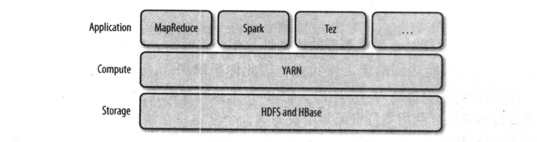
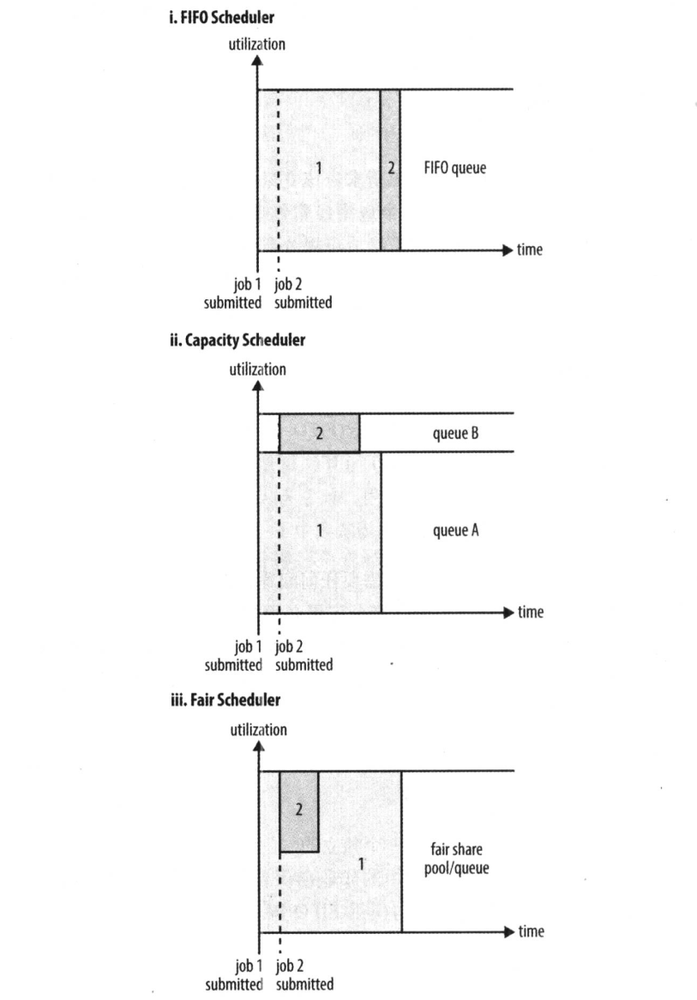

##### yarn 层级关系



```
yarn 提供使用资源 api, 用户很少直接调用 yarn api, 用户使用构造建 yarn 基础上应用的 api, 如Spark, Tez 等
```

##### yarn 核型

- yarn 核心服务由两个守护进程:
  - resource manager 资源管理器
  - node manager 节点管理器, 启动和监控容器
- 为了在 yarn 运行应用, 首先客户端联系资源管理器要求它运行一个 application master 进程
  资源管理器找到一个能在容器中启动 application master 的节点管理器

##### 资源申请

- 请求容器时可以指定每个容器的资源 (CPU和内存) 数量
- yarn 应用 (MapReduce, Spark, tez等) 可以在运行中的任意时刻提出资源申请, 动态的根据需求变化申请资源
- 本地化可以减少带宽
- 申请资源优先级: 有时本地无法满足申请的资源, yarn 尝试在同一个机架上的其他节点上启动容器, 如果还不行则尝试在集群任意节点启动容器
- 例如启动容器用于处理 HDFS 数据块时, 按优先级向节点申请容器:
  - 存储数据块复本的节点
  - 存储这些复本所在机架的一个节点
  - 集群中的任意节点

##### yarn 三种调度器



- 理想情况下 yarn 发出资源请求应该立刻满足. 但资源有限, 在繁忙的集群上一个应用通常需要等待才能得到所需要的资源.
- FIFO Scheduler (FIFO 调度器): 
  - 将作业放置在队列中, 按照提交顺序运行作业
  - 先给第一个作业的请求分配资源, 第一个作业请求满足后为第二个作业分配资源
  - 缺点: 大的应用会占用所有的资源, 下作业一直被阻塞, 直到大作业完成.
- Capacity Scheduler (容量调度器):
  - 预留专门的对了执行小作业, 队列被分配以部分资源, 保证小作业及时执行
  - 缺点: 降低了整个集群的利用率; 与 FIFO 调度器相比大作业的执行时间延长了.
- Fair Scheduler (公平调度器):
  - 不需要预留资源, 在所有运行的作业之间动态平衡资源.
  - 第一个作业启动时, 它是唯一运行的作业, 获取集群的所有资源. 第二个作业启动时, 他被分配到集群的一半资源, 这样每个作业都能平等共享资源.
  - 第二个作业启动到获取资源有滞后, 因为必须等待第一个作业这部分容器执行完并释放资源后才能获取. 当第二个作业执行完并释放资源后, 第一个作业将再次使用集群的全部资源.

##### 容量调度器配置

- 容器调度器允许多用户共享一个 hadoop 集群, 每个用户配置一个专门的队列并分配资源. 同理, 每个队列可以继续按层次拆分并分配一定资源.

- 在队列中使用的是 FIFO 调度器?????

- 弹性队列: 单个作业使用的资源不会超过其队列容量. 当队列中有多个队列并队列资源不够用时, 如果其他队列仍有空闲资源, 容量调度器可能将空闲资源分配给这个队列中的作业, 即使会超过队列的容量

  ```
  <property>
      <name>yarn.scheduler.capacity.root.default.user-limit-factor</name>
      <value>1</value>
  </property>
  
  属性 
  yarn.scheduler.capacity.<queue-pach>.user-limit-factor 值大于 1 表示可以使用超出队列容量的资源
  ```

- 可以为弹性队列设置最大容量限制, 使队列不会过多占用其他队列资源

- 正常情况下, 容量调度器不会通过强行终止来抢占容器. 因此如果一个队列开始时资源够用, 随着需求增长资源不够用了, 这个队列只能等其他队列释放容器资源

- 通过 mapreduce.job.queuename 设置应用放置到哪个队列, 如果队列不存在提交时会发生错误, 不指定队列将放置到 default 队列中.

- 示例

  - 用户层级关系

    ```
    prod 占 40% 容量
    dev 占 60% 容量
    test1 占 50% 容量
    test2 占 50% 容量
    
    
    root
    ├── dev
    │   ├── test1
    │   └── test2
    └── prod
    ```

  - capacity-scheduler.xml 设置

    ```xml
    <configuration>
        <property>
            <!--在 root 队列下创建两个队列 prod 和 dev-->
            <name>yarn.scheduler.capacity.root.queues</name>
            <value>prod,dev</value>
        </property>
        <property>
            <!--在 dev 队列下创建两个队列 test1 和 test2-->
            <name>yarn.scheduler.capacity.root.dev.queues</name>
            <value>test1,test2</value>
        </property>
        <property>
            <!--root.prod 占用 40% 的容量-->
            <name>yarn.scheduler.capacity.root.prod.capacity</name>
            <value>40</value>
        </property>
        <property>
            <name>yarn.scheduler.capacity.root.dev.capacity</name>
            <value>60</value>
        </property>
        <property>
            <!--root.prod 最大占容器的 75%-->
            <name>yarn.scheduler.capacity.root.prod.maximum-capacity</name>
            <value>75</value>
        </property>
        <property>
            <!--root.dev.test1 占用 dev.test1 容量的 50%-->
            <name>yarn.scheduler.capacity.root.dev.test1.capacity</name>
            <value>50</value>
        </property>
        <property>
            <name>yarn.scheduler.capacity.root.dev.test2.capacity</name>
            <value>50</value>
        </property>
        <property>
            <!--值大于 1 表示可以使用超出队列容量的资源-->
            <name>yarn.scheduler.capacity.root.default.user-limit-factor</name>
            <value>1</value>
        </property>
    </configuration>
    ```
    
    

##### 公平调度器配置

>  当没 fair-allocation.xml  文件时, 每个应用放置在一个以用户名命名的队列中, 队列在用户提交第一个应用时创建

- 启动公平调度器

  ```xml
  <property>
  	<name>yarn.resourcemanager.scheduler.class</name>
  	<value>org.apache.hadoop.yarn.server.resourcemanager.scheduler.fair.FairScheduler</value>
  </property>
  ```

- 队列设置

  - 队列层次

    ```
    root
    ├── dev
    │   ├── test1
    │   └── test2
    └── prod
    ```

  - 通过 yarn-site.xml 指定公平调度器配置文件路径

    ```xml
    <property> 
         <name>yarn.scheduler.fair.allocation.file</name> 
         <value>/opt/hadoop-3.2.2/etc/hadoop/fair-allocation.xml</value> 
    </property>  
    ```

  - fair-allocation.xml 

    > 1. queue 嵌套表示队列的层次
    >
    > 2. 所有队列都在 root 下, 即使没有显示写出来. dev 分成 test1 和 test2
    >
    > 3. 队列的权重: 表示分配资源的比值. 这个例子中 prod 和 dev 资源按照 40:60 分配时被认为是公平的, 效果和 2:3 效果一样. 
    > 4. test1 和 test2 没设置权重, 则平均分配
    > 5. 默认的队列和动态创建的队列(如以用户名创建的队列), 默认权重值为 1
    > 6. 每个队列可以使用 defaultQueueSchedulingPolicy 指定不同的调度策略, 包括 fifo, capacity,fair(默认)

    ```xml
    <?xml version="1.0" encoding="utf-8"?>
    
    <allocations> 
      <defaultQueueSchedulingPolicy>fair</defaultQueueSchedulingPolicy>  
      <queue name="prod"> 
        <weight>40</weight>  
        <schedulingPolicy>fifo</schedulingPolicy> 
      </queue>  
      <queue name="dev"> 
        <weight>60</weight>  
        <queue name="test1"/>  
        <queue name="test2"/>
      </queue>  
      <queuePlacementPolicy> 
        <rule name="specified" create="false"/>  
        <rule name="primaryGroup" create="false"/>  
        <rule name="default" queue="dev.test2"/> 
      </queuePlacementPolicy> 
    </allocations>
    ```


```


权重是比值, 不是百分比, 


```


# todo

```
公平调度器设置 https://blog.csdn.net/weixin_30872157/article/details/95364486

https://www.iteye.com/blog/han-zw-2322189
```

