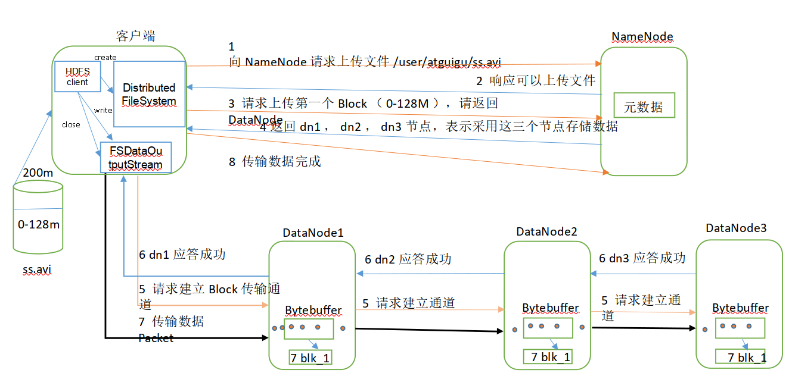
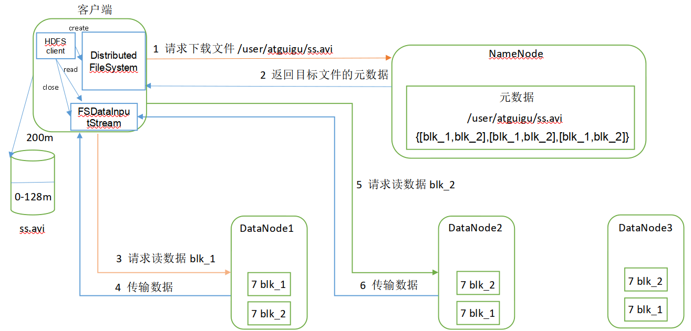
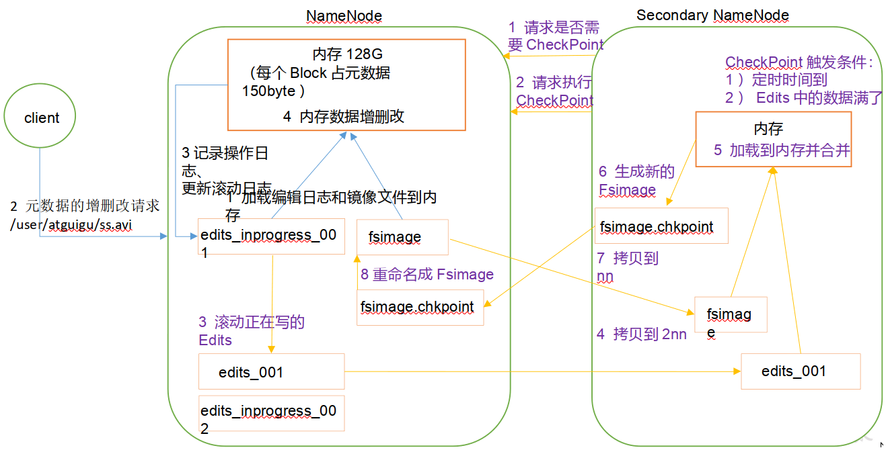

##### 特点

- 分布式文件管理系统, 将文件先分成数据块, 再存储
- 适合一次写入多次读取, 不支持文件修改, 适合做数据分析
- 优点
  - 高容错: 数据自动保存多个副本, 增加副本来提高容错
  - 数据规模大
  - 文件规模大
  - 可构建在廉价机器
- 缺点
  - 不适合低延时数据访问, 比如做不到毫秒级数据
  - 无法高效对大量小文件存储. 占用NameNode大量的内存存储目录和块信息, 小文件存储的寻址时间超过读取时间
  - 不支持并发写入, 文件随机修改, 和以对文件进行追加

##### 命令

```
hadoop fs
或
hdfs dfs
```

##### 本地上传到 HDFS

```bash
# 从本地剪切粘贴到HDFS
$ hadoop fs  -moveFromLocal  ./kongming.txt  /sanguo/shuguo

# 从本地文件系统中拷贝文件到HDFS
$ hadoop fs -copyFromLocal README.txt /

# 追加一个文件到已经存在的文件末尾
$ hadoop fs -appendToFile liubei.txt /sanguo/shuguo/kongming.txt

# 从本地文件系统中拷贝文件到HDFS
$ hadoop fs -put ./zaiyiqi.txt /user/atguigu/test/
```

##### HDFS 操作

```bash
$ hadoop fs -ls /
$ hadoop fs -mkdir -p /sanguo/shuguo
$ hadoop fs -rmdir /test
$ hadoop fs -cat /sanguo/shuguo/kongming.txt
$ hadoop fs -chmod  666  /sanguo/shuguo/kongming.txt
$ hadoop fs -chown  atguigu:atguigu
$ hadoop fs -cp /sanguo/shuguo/kongming.txt /zhuge.txt
$ hadoop fs -mv /zhuge.txt /sanguo/shuguo/
$ hadoop fs -tail /sanguo/shuguo/kongming.txt
$ hadoop fs -rm /user/atguigu/test/jinlian2.txt
# 统计文件夹的大小信息
$ hadoop fs -du -s -h /user/atguigu/test
$ hadoop fs -du  -h /user/atguigu/test
# 设置HDFS中文件的副本数量
$ hadoop fs -setrep 10 /sanguo/shuguo/kongming.txt
```

##### HDFS下载到本地

```
get
getmerge
copyTolocal
```

## HDFS上传过程



```
1. 客户端根据配置, 决定文件是否分块上传
2. 客户端通过 FileSystem 模块向 NameNode请求上传文件
3. NameNode检测目标文件是否存在, 对目录有没有写的权限
4. 如果 NameNode 返回可以上传, 客户端请求 NameNode 第一个 Block 上传到哪几个 DataNode 中
5. NameNode 根据副本选择策略返回 NameNode 的节点 dn1, dn2, dn3
6. 客户端通过 FSDataOutputStream 模块请求dn1上传数据, dn1将请求传递给dn2, dn2将请求传递给dn3. dn3 将应答结果传给 dn2, dn2 将结果传给 dn1, dn1 将结果传给客户端, 此时通信管道建立完成. 这样做的目的是较少客户端的压力, 如果 dn1 传递给 dn2 的时候失败了, 会触发 hadoop 的副本备份机制, 将副本备份成3个
7. 客户端开始上传 Block1. 先传给 dn1, nd1 在本地缓存并写入磁盘. 同时将数据传给 dn2, nd2 在本地缓存并写入磁盘, 同时将数据传给 dn3. nd3 缓存后写入磁盘.
8. 当 Block1 上传完成以后上传 Block2, 过程和4 - 7 一样,   
```

## HDFS下载过程

##### DistributedFileSystem

分布式文件系统, 是允许我们在一个集群的多个节点或机器上存储数据，并允许多个用户访问这些数据的文件系统。

#####

#####

#####

##### 上传步骤

- 通过分布式文件系统先与NameNode建立连接，上传自己的元数据。
  - 通过调用客户端的对象Distributed FileSystem的create方法
  - DistributedFileSytem会发起对namenode的一个RPC连接，请求创建一个文件，不包含关于block块的请求。NameNode 检测创建的文件不存在, 客户端具备创建文件的权限。如果检查通过，namenode会创建一个文件（在edits中），否则创建失败，客户端抛出异常
- DistributedFileSystem返回一个FSDataOutputStream对象给客户端用于写数据。FSDataOutputstream封装了一个DFSOutputStream对象负责客户端跟DataNode以及namenode的通信
- 

```
1. 先调用客户端 DistributedFileSystem 的 create方法与 NameNode 建立连接(RPC 连接)，请求创建一个文件, 并上传自己的元数据.数据中不包含关于block块的请求

2. NameNode 检测文件是否存在, 客户端是否有创建文件的权限. 
如果检测没通过, 创建失败, 客户端抛出异常
如果检查通过，NameNode 会创建一个文件（在edits中）,DistributedFileSystem 返回一个 FSDataOutputStream 对象给客户端用于写数据. FSDataOutputstream 封装了一个 DFSOutputStream 对象负责客户端跟DataNode以及namenode的通信

3. 假设文件是256M, 3个 DataNode 节点


4. 开始数据的传输, 将256M的文件分为128M, 向其中一个DataNode节点传输数据, 


FSDataOutputstream 对象会将 block 数据块进行切分，每一个数据包大小为64k, 然后写入一个数据队列, 然后由 DataStream 读取其中的内容, 并请求 NameNode 返回一个 DataNode 列表来存储当前的 block 副本。
DataStream将数据包发送给管线中的第一个DataNode，第一个DataNode将接收到的数据发送给第二个DataNode，第二个在发送给第三个, 在同样传输128M的时间内，完成了三个DataNode节点数据的备份。


4.如上图所示，DFSOutputStream维护着一个数据包的队列（write packet），这个数据包队列不断的向DataNode中写入64k大小的数据。然后将这个小数据包移到（ack packet）队列中。小数据包在第三个DataNode节点写入完毕后，向第二个DataNode节点反馈，第二个节点向第一个节点反馈，然后第一个节点向DFSOutputStream反馈，然后DFSOutputStream删除（ack packet）中的这个数据包，。如此往复就传输完了一个block块。传输完成一个block块后，DataNode会向namenode响应，然后namenode记录下DataNode中的block块信息。


如果同时向这3个 DataNode 传输数据, 就需要占据128M*3的网络带宽, 传输数度受带宽影响
如果一次上传 128M的文件受带宽影响大, 将其拆成 64k 的数据包

```




```
1. 客户端通过 FileSystem 模块向 NameNode 请求下载文件
2. NameNode 通过查询元数据判断文件是否存在, 是否由读的权限
3. 如果可以下载, 客户端请求下载 Block1, NameNode 返回所有 DataNode, dn1, dn2, dn3
4. 客户端找到距离最近的 dn1, 请求下载, dn1 应答成功则开始下载. 如果dn1 失败则去 nd2 下载, 如果 dn2 失败则去 dn3 下载. 如果都失败则下载失败
5. Block1 下载完成以后, 下载 Block2
```

##### HDFS 副本选择策略

```


```

##### 2nn的作用

```


```

##### nn 和 2nn 的关系



```

元数据存放在内存中
但如果只存在内存中，一旦断电，元数据丢失，整个集群就无法工作了。因此产生在磁盘中备份元数据的FsImage。


```


