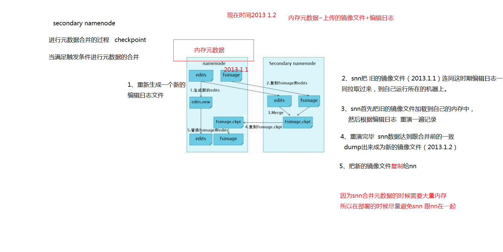

```
参考
https://www.cnblogs.com/jifengblog/p/9307791.html
```

##### 元数据是什么

```
元数据(Metadata)是 HDFS 的目录结构

NameNode 维护整个文件系统元数据, 元数据的准确管理，影响着 HDFS 提供文件存储服务的能力

元数据操作(Metadata ops)
```

##### 元数据存了什么

```
1. 文件、目录自身的属性信息，例如文件名，目录名，修改信息等
2. 文件记录的信息的存储相关的信息，例如存储块信息，分块情况，副本个数等
3. 记录 HDFS 的 DataNode 的信息，用于 DataNode 的管理
```

##### 存储位置分类

```
1. 内存元数据: 存在内存上, 支持客户端的读操作，也是最完整的元数据
2. 元数据文件: 存在磁盘上, 用于持久化存储


这样设计好处:
1. 内存中数据更新、查询快，极大缩短了操作响应时间；
2. 内存中元数据丢失风险颇高（断电等），因此辅佐元数据镜像文件（fsimage）+编辑日志文件（edits）的备份机制进行确保元数据的安全。
```

##### 元数据文件

- 分为 fsimage(镜像文件) 和 Edits(编辑日志文件), 都是经过序列化的
- fsimage: 存的是 Hadoop 文件系统中的所有目录和文件元数据信息，但不包含文件块位置的信息。文件块位置信息只存储在内存中，是在 DataNode 加入集群的时候，NameNode 询问 DataNode 得到的，并且间断的更新。
- Edits: 存的是 Hadoop 文件系统的所有更改操作（文件创建，删除或修改）的日志，文件系统客户端执行的更改操作首先会被记录到 edits 文件中
- 在 NameNode 启动的时候，它会将 fsimage文件中的内容加载到内存中，之后再执行 edits 文件中的各项操作，使得内存中的元数据和实际的同步
- 当客户端对 HDFS 中的文件进行新增或者修改操作，操作记录首先被记入 edits 日志文件中，当客户端操作成功后，相应的元数据会更新到内存元数据中
- fsimage 文件一般都很大（GB 级别的很常见），如果所有的更新操作都往 fsimage 文件中添加，这样会导致系统运行的十分缓慢。

##### NameNode 格式化作用

- 在 Hadoop 的 HDFS 首次部署好配置文件之后，并不能马上启动使用，而是先要对文件系统进行格式化

  - 文件系统: 此时的文件系统在物理上还不存在

  - 格式化: 并不是指传统意义上的本地磁盘格式化，而是一些清除与准备工作

  - 需要在 NameNode 上执行

    ```
    $ HADOOP_HOME/bin/hdfs NameNode –format
    ```

- 格式化完成之后，将会在 dfs.NameNode.name.dir/current 目录下创建文件，这个目录也正是 NameNode 元数据相关的文件目录

  ```
  <property>
      <name>dfs.NameNode.name.dir</name>
      <value>file://${hadoop.tmp.dir}/name</value>
  </property>
  ```

  ```
  current/
  ├── edits_0000000000000000001-0000000000000000002
  ├── edits_0000000000000000003-0000000000000000011
  ├── edits_0000000000000000109-0000000000000000117
  ├── edits_0000000000000000118-0000000000000000119
  ├── edits_inprogress_0000000000000000120
  ├── fsimage_0000000000000000117
  ├── fsimage_0000000000000000117.md5
  ├── fsimage_0000000000000000119
  ├── fsimage_0000000000000000119.md5
  ├── seen_txid
  └── VERSION
  ```

- dfs.NameNode.name.dir 属性可以配置多个目录，各个目录存储的文件结构和内容都完全一样，相当于备份，这样做的好处是当其中一个目录损坏了，也不会影响到 Hadoop 的元数据，特别是当其中一个目录是 NFS（网络文件系统 Network File System，NFS）之上，即使你这台机器损坏了，元数据也得到保存。

- 格式化集群的时候，可以指定集群的 cluster_id，但是不能与环境中其他集群有冲突. 如果没有提供 cluster_id，则会自动生成一个唯一的 ClusterID

  ```
  $ HADOOP_HOME/bin/hdfs NameNode -format -clusterId <cluster_id>
  ```

##### VERSION 文件

```
[gong@centos102 current]$ cat VERSION 
#Tue Jun 08 14:20:17 UTC 2021
storageID=DS-373401b5-7d06-44b4-bb7f-0761358c7dd9
clusterID=CID-da9f9214-5cf8-4281-80d9-299c4a223efd
cTime=0
datanodeUuid=c6e02431-8741-4b57-aac4-f05f07edcb30
storageType=DATA_NODE
layoutVersion=-57


说明:
namespaceID/clusterID/blockpoolID 这些都是 HDFS 集群的唯一标识符。标识符被用来防止 DataNodes 意外注册到另一个集群中的 NameNode 上。这些标识在联邦（federation）部署中特别重要。联邦模式下，会有多个 NameNode 独立工作。每个的 NameNode 提供唯一的命名空间（namespaceID），并管理一组唯一的文件块池（blockpoolID）。clusterID 将整个集群结合在一起作为单个逻辑单元，在集群中的所有节点上都是一样的。

storageType 说明这个文件存储的是什么进程的数据结构信息（如果是 DataNode，storageType=DATA_NODE）；

cTime NameNode 存储系统创建时间，首次格式化文件系统这个属性是 0，当文件系统升级之后，该值会更新到升级之后的时间戳；

layoutVersion 表示 HDFS 永久性数据结构的版本信息，是一个负整数。
```

##### seen_txid 文件

- 用于保存 transactionId 的文件，它代表的是 NameNode 里面的 edits_*文件的尾数，NameNode 重启的时候，循序从头跑 edits_0000001~到 seen_txid 的数字。所以当你的 hdfs 发生异常重启的时候，一定要比对 seen_txid 内的数字是不是你 edits 最后的尾数。
- 刚格式化之后值为 0

```
[gong@centos101 current]$ cat seen_txid 
120
```

##### secondary NameNode

- 当 HDFS 集群运行一段时间后，就会出现下面一些问题：

  ```
  1. edit logs 文件会变的很大
  2. NameNode 重启会花费很长时间，因为有很多改动要合并到 fsimage 文件上
  3. 如果 NameNode 挂掉了，那就丢失了一些改动。因为此时的 fsimage 文件非常旧。
  ```

- Secondary NameNode 作用

  ```
  合并 NameNode 的 editlogs 到 fsimage 文件中, 减小 edit logs 文件的大小和得到一个最新的fsimage 文件，这样也会减小在 NameNode 上的压力。
  ```

- Secondary NameNode 根本就不是 NameNode 的一个热备，其只是将 fsimage 和 edits 合并。其拥有的 fsimage 不是最新的，因为在他从 NameNode 下载 fsimage 和 edits 文件时候，新的更新操作已经写到 edit.new 文件中去了。而这些更新在 Secondary NameNode 是没有同步到的！当然， 如果 NameNode 中的 fsimage 真的出问题了，还是可以用Secondary NameNode 中的 fsimage 替换一下NameNode 上的 fsimage ，虽然已经不是最新的 fsimage ，但是我们可以将损失减小到最少！

##### Checkpoint

- 每达到触发条件，会由 secondary NameNode 将 NameNode 上积累的所有 edits 和一个最新的 fsimage 下载到本地，并加载到内存进行 merge, 这个过程称为 checkpoint

- Checkpoint 执行过程

  ```
  当触发 checkpoint 操作时，NameNode 会生成一个新的 edits 即上图中的 edits.new 文件，同时 Secondary NameNode 会将 edits 文件和 fsimage 复制到本地（HTTP GET 方式）。
  
  Secondary NameNode 将下载下来的 fsimage 载入到内存，然后一条一条地执行 edits 文件中的各项更新操作，使得内存中的 fsimage 保存最新，这个过程就是edits 和fsimage文件合并，生成一个新的 fsimage 文件即上图中的 Fsimage.ckpt 文件。
  
  Secondary NameNode 将新生成的 Fsimage.ckpt 文件复制到 NameNode 节点。
  
  在 NameNode 节点的 edits.new 文件和 Fsimage.ckpt 文件会替换掉原来的 edits 文件和 fsimage 文件，至此刚好是一个轮回，即在 NameNode 中又是 edits 和 fsimage 文件。
  
  等待下一次 checkpoint 触发 Secondary NameNode 进行工作，一直这样循环操作。
  ```

  

- Checkpoint 操作受两个参数控制，可以通过 core-site.xml 进行配置

  ```
  <property>
  　　<name> dfs.NameNode.checkpoint.period</name>
  　　<value>3600</value>
  　　<description>
  　　　　两次连续的 checkpoint 之间的时间间隔。默认 1 小时
  　　</description>
  </property>
  <property>
  　　<name>dfs.NameNode.checkpoint.txns</name>
  　　<value>1000000</value>
  　　<description>
  　　　　最大的没有执行 checkpoint 事务的数量，满足将强制执行紧急 checkpoint，即使
  　　　　尚未达到检查点周期。默认设置为 100 万。
  　　</description>
  </property>
  ```


