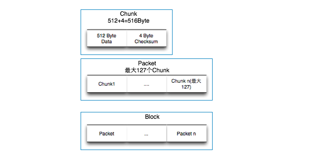
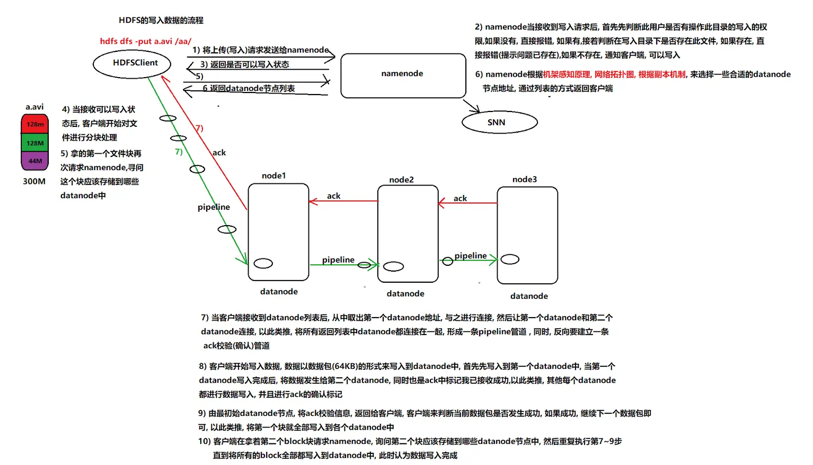
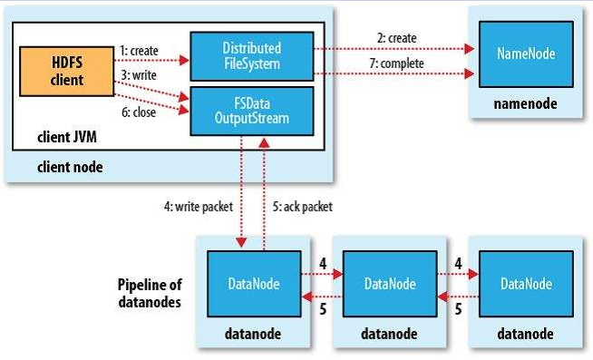

## 概念

##### pipeline

```
```

##### block

```
1. 文件上传前需要分块，这个块就是block，一般为128MB，可以修改该。
2. 块太小寻址时间占比过高。块太大Map任务数太少，作业执行速度变慢
3. 当block不足128M时, 占用实际大小空间
```

##### packet

```
是 client 端向 DataNode，或 DataNode 的 PipLine 之间传数据的基本单位，默认64KB
```

##### chunk

```
是 client 向 DataNode, 或 DataNode 的 PipLine 之间进行数据校验的基本单位，默认512Byte, 4Byte校验位, 实际为516Byte
```

##### block packet chunk 关系



```
每个Chunk是由512Byte的数据位和4Byte的校验位组成，
每个Packet是由127个Chunk组成，大小是127*(512+4)=65532Byte
最后如果写入写到了Block size的边界位置，发送一个空白的Packet
```

##### 读写过程数据完整性

```
通过校验和。因为每个chunk中都有一个校验位，一个个chunk构成packet，一个个packet最终形成block，故可在block上求校验和。

HDFS 的client端即实现了对 HDFS 文件内容的校验和 (checksum) 检查。当客户端创建一个新的HDFS文件时候，分块后会计算这个文件每个数据块的校验和，此校验和会以一个隐藏文件形式保存在同一个 HDFS 命名空间下。当client端从HDFS中读取文件内容后，它会检查分块时候计算出的校验和（隐藏文件里）和读取到的文件块中校验和是否匹配，如果不匹配，客户端可以选择从其他 Datanode 获取该数据块的副本。
```

## 写数据详细过程



##### 补充

- 第1步

```
使用 HDFS 提供的客户端 Client，向远程的 namenode 发起 RPC 请求


当前请求会包含一个非常重要的信息： 上传的数据的总大小
```

- 第2步

```
根据 WAL(write ahead log), 先写Log文件，再写内存，因为EditLog记录的是最新的HDFS客户端执行所有的写操作。如果后续真实写操作失败了，由于在真实写操作之前，操作就被写入 EditLog 中了，故EditLog中仍会有记录，我们不用担心后续client读不到相应的数据块，因为DataNode收到块后会有一返回确认信息，若没写成功，发送端没收到确认信息，会一直重试，直到成功
```

- 第7步

```
ppipeline 通道由 client - node1 - node2 - node3 组成
ppipeline 通道连通后返回确认信息给客户端, 表示通道已连通，可以传输数据
客户端把 packet 以流的方式写入第一个 node1，该 datanode 把 packet 在本地, 同时将其传递给在此 pipeline 中的下一个 node2 ，直到最后一个 node3

当客户端开始写入文件的时候，客户端会将文件切分成多个 packets，并在内部以数据队列 data queue（数据队列）的形式管理这些 packets

最后一个 datanode 成功存储之后会返回一个 ack packet（确认队列），在 pipeline 里传递 至客户端，在客户端的开发库内部维护着"ack queue"，成功收到 datanode 返回的 ack packet 后会从"data queue"移除相应的 packet。

```

- 第10步

```
客户端完成数据的写入后，会对数据流调用 close()方法，关闭数据流
```

##### 写入失败后如何处理

```
6、如果传输过程中，有某个 datanode 出现了故障，那么当前的 pipeline 会被关闭，出现故 障的 datanode 会从当前的 pipeline 中移除，剩余的 block 会继续剩下的 datanode 中继续 以 pipeline 的形式传输，同时 namenode 会分配一个新的 datanode，保持 replicas 设定的 数量。


8、只要写入了 dfs.replication.min（最小写入成功的副本数）的复本数（默认为 1），写操作 就会成功，并且这个块可以在集群中异步复制，直到达到其目标复本数（dfs.replication 的默认值为 3），因为 namenode 已经知道文件由哪些块组成，所以它在返回成功前只需 要等待数据块进行最小量的复制。
```


##### 从 java 角度理解



```
1. 调用客户端的对象DistributedFileSystem的create方法

2. DistributedFileSystem会发起对 NN 的一个RPC连接，请求创建一个文件，不包含关于block块的请求。 NN 会执行各种各样的检查，确保要创建的文件不存在，并且客户端有创建文件的权限。如果检查通过， NN 会创建一个文件（在edits中），否则创建失败，客户端抛异常IOException。

3. DistributedFileSystem 返回一个 FSDataOutputStream 对象给客户端用于写数据。FSDataOutputStream 封装了一个 DFSOutputStream 对象负责客户端跟 DN 以及 NN 的通信。

4. FSDataOutputStream 对象将数据切分为小的数据包 packet（64kb），并写入到一个内部队列（“数据队列”）。DataStreamer 会读取其中内容，并请求 NN 返回一个 DN 列表来存储当前block副本。列表中的 DN 会形成管线，DataStreamer将数据包发送给管线中的第一个 DN ，第一个 DN 将接收到的数据发送给第二个 DN ，第二个发送给第三个

5.DFSOoutputStream 维护着一个数据包的队列，这的数据包是需要写入到 DN 中的，该队列称为确认队列。当一个数据包在管线中所有 DN 中写入完成，就从ack队列中移除该数据包。队列是在客户端维护的。

6.如果在数据写入期间 DN 发生故障，则执行以下操作

a、关闭管线，把确认队列中的所有包都添加回数据队列的最前端，以保证故障节点下游的 DN 不会漏掉任何一个数据包。

b、为存储在另一正常 DN 的当前数据块指定一个新的标志，并将该标志传送给 NN ，以便故障 DN 在恢复后可以删除存储的部分数据块。

c、如果在数据写入期间 DN 发生故障，待确认消息队列迟迟得不到确认消息，这时会有一个超时时间，超过这个时间，从管线中删除故障数据节点并且把余下的数据块写入管线中另外两个正常的 DN （也就是这两个节点组成新的管线并且blockID的值要发生变化，另外注意正常的节点中包括之前上传的部分小的64K文件，所以需要对其就行一个统计，确认我现在数到第几个包了，避免重复提交）。 NN 在检测到副本数量不足时，会在另一个节点上创建新的副本。

d、后续的数据块继续正常接受处理。

7.在一个块被写入期间可能会有多个 DN 同时发生故障，但非常少见。只要设置了dfs.replication.min的副本数（默认为1），写操作就会成功，并且这个块可以在集群中异步复制，直到达到其目标副本数（dfs.replication默认值为3）。

8.如果有多个block，则会反复从步骤4开始执行。

9.当客户端完成了数据的传输，调用数据流的close方法。该方法将数据队列中的剩余数据包写到 DN 的管线并等待管线的确认

10.客户端收到管线中所有正常 DN 的确认消息后，通知 NN 文件写完了。

11.客户端完成数据的写入后，对数据流调用close方法。该操作将剩余的所有数据包写入 DN 管线，并在联系到 NN 且发送文件写入完成信号之前，等待确认。

 NN 已经知道文件由哪些块组成，所以它在返回成功前只需要等待数据块进行最小量的复制。

注意：如果在数据写入期间 DN 发生故障，待确认消息队列迟迟得不到确认消息，这时会有一个超时时间，超过这个时间

文件写文件的时候只有一个客户端能写，保证数据上传成功

```

# todo 

```
https://segmentfault.com/a/1190000039097265
```


