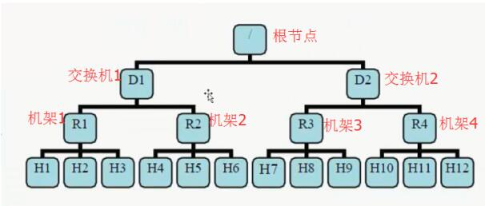

```
https://www.cnblogs.com/ggjucheng/archive/2013/01/03/2843015.html
https://www.cnblogs.com/bigdata-stone/p/9311851.html
https://blog.csdn.net/tracymkgld/article/details/18598657
https://blog.csdn.net/qq_39888645/article/details/105528661
https://blog.csdn.net/fantasticqiang/article/details/80674264
```


##### 产生背景

```
分布式的集群通常包含非常多的机器，由于受到机架槽位(rack)和交换机网口的限制，通常大型的分布式集群都会跨好几个机架，由多个机架上的机器共同组成一个分布式集群。机架内的机器之间的网络速度通常都会高于跨机架机器之间的网络速度，并且机架之间机器的网络通信通常受到上层交换机间网络带宽的限制
```

##### hadoop 默认副本存放策略

- hadoop的HDFS对数据文件的分布式存放是按照分块block存储，每个block会有多个副本(默认为3)，并且为了数据的安全和高效，所以hadoop默认对副本的存放策略为
  - 第一个block副本放在和client所在的datanode里（如果client不在集群范围内，则这第一个node是随机选取的）。
  - 第二个副本放置在与第一个节点不同的机架中的datanode中（随机选择）。
  - 第三个副本放置在与第二个副本所在节点同一机架的另一个节点上。
  - 如果还有更多的副本就随机放在集群的datanode里
- 为了降低整体的带宽消耗和读取延时，HDFS会尽量让读取程序读取离它最近的副本. 如果在读取程序的同一个机架上有一个副本，那么就读取该副本. 如果整个机架的网络出现异常，在其它机架的节点上找到数据
- 默认情况下，hadoop的机架感知是没有被启用的, hadoop集群的HDFS在选机器的时候，是随机选择的. 需要人为设置机器属于哪个rack，这样在hadoop的namenode启动初始化时，会将这些机器与rack的对应信息保存在内存中，作为写块操作时分配datanode列表时选择datanode的依据
- 在job处理的数据量非常的大，或者往hadoop推送的数据量非常大的时候，造成rack之间的网络流量成倍的上升，成为性能的瓶颈，进而影响作业的性能以至于整个集群的服务 

##### 网络拓扑

```
有了机架感知，NameNode就可以画出datanode网络拓扑图

如H1的rackid=/D1/R1/H1H1的parent是R1，R1的是D1。

这些rackid信息可以通过topology.script.file.name配置。

有了这些rackid信息就可以计算出任意两台datanode之间的距离。

distance(/D1/R1/H1,/D1/R1/H1)=0  相同的datanode
distance(/D1/R1/H1,/D1/R1/H2)=2  同一rack下的不同datanode
distance(/D1/R1/H1,/D1/R1/H4)=4  同一IDC下的不同datanode
distance(/D1/R1/H1,/D2/R3/H7)=6  不同IDC下的datanode

这个距离即使节点间连线的个数
```




