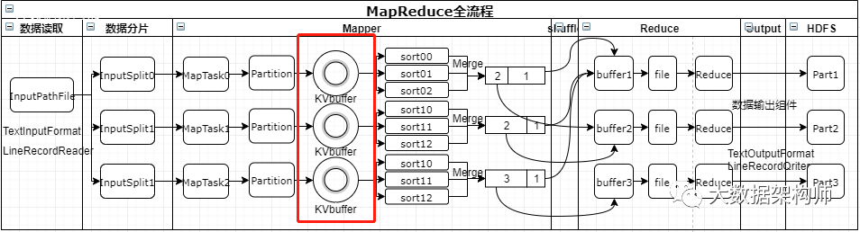
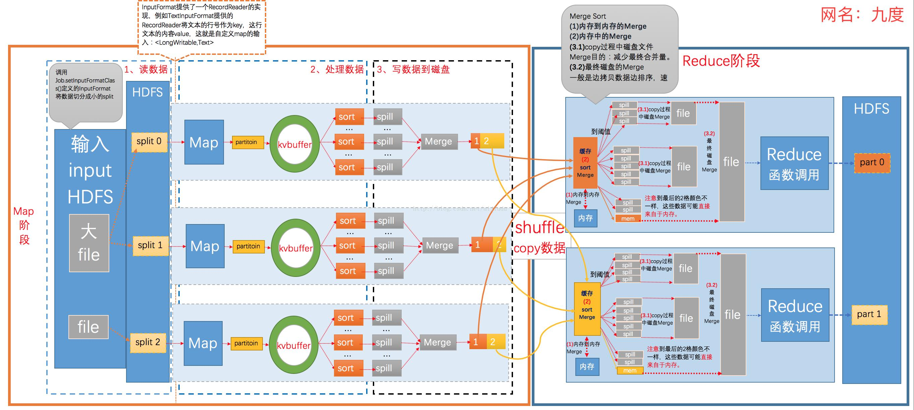

## MapReduce的大致流程






```
1、input组件从HDFS读取数据；
2、按照规则进行分片，形成若干个spilt；
3、进行Map
4、打上分区标签（patition）
5、数据入环形缓冲区（KVbuffer）
6、原地排序，并溢写（sort+spill）
7、combiner+merge，落地到磁盘
8、shuffle到reduce缓存
9、继续归并排序（mergesotr）
10、reduce
11、输出到HDFS
```

##### MapReduce 计算模型三个阶

```
1. Map: 映射，负责数据的过滤分类，将原始数据转化为键值对；
2. Shuffle: 为了让Reduce可以并行处理Map的结果，必须对Map的输出进行一定的排序与分割，然后再交给对应的Reduce，这个过程就是Shuffle。
3. Reduce: 合并，将具有相同key值的value进行处理后再输出新的键值对作为最终结果
```

##### 执行任务的特点

> 一个比较形象的语言解释MapReduce　
> 我们要数图书馆中的所有书。你数1号书架，我数2号书架。这就是“Map”。我们人越多，数书就更快。
> 现在我们到一起，把所有人的统计数加在一起。这就是“Reduce”

```
1. 一个 MapReduce 作业通常会把输入的数据集切分为若干独立的数据块，由Map任务以完全并行的方式去处理它们

2. 通常，MapReduce框架和分布式文件系统是运行在一组相同的节点上，也就是说，计算节点和存储节点通常都是在一起的。这种配置允许框架在那些已经存好数据的节点上高效地调度任务，这可以使得整个集群的网络带宽被非常高效地利用
```

##### MapReduce 进程

```
一个完整的MapReduce程序在分布式运行时有三类实例进程：
	1.MrAppMaster：负责整个程序的过程调度及状态协调
	2.MapTask：负责Map阶段的整个数据处理流程，并发执行，数目由数据的分片数决定，map()按行处理，对每个键值对调用一次。
	3.ReduceTask：负责Reduce阶段的整个数据处理流程，并发执行，数目由数据的分区数决定。reduce()对每一组相同键的键值对调用一次。
```

## map阶段

##### 切片（split）

```
在进行map计算之前, MapReduce会根据输入文件计算 split, 每个 split 针对一个map任务, split 存储的并非数据本身, 而是一个分片长度和一个记录数据的位置的数组
```

##### map函数作用

```
Map负责“分”，即把复杂的任务分解为若干个“简单的任务”来处理。“简单的任务”包含三层含义：
一是数据或计算的规模相对原任务要大大缩小；
二是就近计算原则，即任务会分配到存放着所需数据的节点上进行计算；
三是这些小任务可以并行计算，彼此间几乎没有依赖关系。
```

##### Mapper 个数造成的影响

```
1. Mapper 个数过大的话，会产生大量的小文件，由于Mapper是基于虚拟机的，过多的Mapper创建和初始化及关闭虚拟机都会消耗大量的硬件资源；
2. Mapper 个数太小，并发度过小，Job执行时间过长，无法充分利用分布式硬件资源
```

##### 设置 Mapper 个数

- 计算公式

  ```
  splitSize = Math.max(minSize, Math.min(maxSize, blockSize));
  
  默认情况下示例:
  1. 例如一个文件800M，Block大小是128M，那么Mapper数目就是7个。6个Mapper处理的数据是128M，1个Mapper处理的数据是32M；
  2. 例如一个目录下有三个文件大小分别为：5M 10M 150M 这个时候其实会产生四个Mapper处理的数据分别是5M，10M，128M，22M
  
  就如上面，5M，10M的数据很快处理完了，128M要很长时间
  减少Mapper的个数的话，就要合并小文件，这种小文件有可能是直接来自于数据源的小文件，也可能是Reduce产生的小文件。
  ```

- 方式1: 通过 hive 的 set脚本设置

  ```
  set hive.input.format=org.apache.hadoop.hive.ql.io.CombineHiveInputFormat;
  set hive.merge.mapFiles=true;
  set hive.merge.mapredFiles=true;
  //每个Mapper要处理的数据，就把上面的5M10M……合并成为一个
  set hive.merge.size.per.task=256000000;
  // mapred切分的大小
  set mapred.max.split.size=256000000 
  //低于128M就算小文件，数据在一个节点会合并，在多个不同的节点会把数据抓过来进行合并。
  set mapred.min.split.size.per.node=128000000
  ```

- 方式2: 通过 Hadoop 参数设置

  ```
  Hadoop中的参数：可以通过控制文件的数量控制mapper数量
  mapreduce.input.fileinputformat.split.minsize（default：0），小于这个值会合并
  mapreduce.input.fileinputformat.split.maxsize 大于这个值会切分
  ```

##### Partition (分区)

- 作用

  ```
  1. 把同一类的数据，划分到一个地方去，划分到同一个reduce当中去
  2. 默认使用的是 HashPartitioner 这个类来对数据进行分区
  ```

- HashPartitioner 分区源代码

  ```java
  public class HashPartitioner<K, V> extends Partitioner<K, V> {
    /** Use {@link Object#hashCode()} to partition. */
    public int getPartition(K key, V value, int numReduceTasks) {
      return (key.hashCode() & Integer.MAX_VALUE) % numReduceTasks;
    }
  }
  
  /*
  1.首先根据key取hash值,相同key的hash值相同，所以key相同的键会被发送到相同的reduce。
  2.然后与最大值相与(&)，得到一个正整数
  3.求余，余数即是该《key,value》将被发送到的reduce
  */
  
  
  1. HashPartitioner 能够将相同的数据均衡的发送到reduce，这已经能够满足大部分程序的需求。
  2. 但有时由于发生数据倾斜, 导致过多的《key,value》被发送到同一reduce，个别reduce运行极慢，严重拖后了程序运行速度。
  ```

- 自定义分区

  ```
  1、我们知道每一个Reduce的输出都是有序的，但是将所有Reduce的输出合并到一起却并非是全局有序的，如果要做到全局有序，我们该怎么做呢？最简单的方式，只设置一个Reduce task，但是这样完全发挥不出集群的优势，而且能应对的数据量也很受限。最佳的方式是自己定义一个Partitioner，用输入数据的最大值除以系统Reduce task数量的商作为分割边界，也就是说分割数据的边界为此商的1倍、2倍至numPartitions-1倍，这样就能保证执行partition后的数据是整体有序的。
  
  2、解决数据倾斜：另一种需要我们自己定义一个Partitioner的情况是各个Reduce task处理的键值对数量极不平衡。对于某些数据集，由于很多不同的key的hash值都一样，导致这些键值对都被分给同一个Reducer处理，而其他的Reducer处理的键值对很少，从而拖延整个任务的进度。当然，编写自己的Partitioner必须要保证具有相同key值的键值对分发到同一个Reducer。
  
  3、自定义的Key包含了好几个字段，比如自定义key是一个对象，包括type1，type2，type3,只需要根据type1去分发数据，其他字段用作二次排序。
  ```

##### 合并（combiner）

```
combiner是一个本地化的reduce操作，它是map运算的后续操作，主要是在map计算出中间文件前做一个简单的合并重复key值的操作。

例如，我们对文件里的单词频率做统计，map计算时候如果碰到一个hadoop的单词就会记录为1，但是这篇文章里hadoop可能会出现n多次，那么map输出文件冗余就会很多，因此在reduce计算前对相同的key做一个合并操作，那么文件会变小。这样就提高了宽带的传输效率，毕竟hadoop计算力宽带资源往往是计算的瓶颈也是最为宝贵的资源。

但是combiner操作是有风险的，使用它的原则是combiner的输入不会影响到reduce计算的最终输入。例如：如果计算只是求总数，最大值，最小值可以使用combiner，但是做平均值计算使用combiner的话，最终的reduce计算结果就会出错。


-----------------------


Combiner是MR程序中Mapper和Reducer之外的一种组件，其父类是Reducer。
Combiner和Reducer的区别在于运行的位置：
Combiner在每一个Maptask所在节点运行。
Reducer是接收全局所有Mapper的输出结果。
Combiner的意义就是对每一个Maptask的输出进行局部汇总，以减小网络传输量。
Combiner能够应用的前提是不能影响最终的业务逻辑，而且Combiner的输出kv类型应该与Reducer的输入kv类型一致。
合并是优化的方式之一，适合处理汇总操作，不能处理求平均值的操作，因为会影响最终的业务逻辑。
自定义类，由job进行关联。
```

##### 重排（shuffle）

```
map的输出作为reduce的输入的过程就是shuffle了，这个是MapReduce优化的重点地方。
shuffle一开始就是map阶段做输出操作，一般MapReduce计算的都是海量数据，map输出时候不可能把所有文件都放到内存操作，因此map写入磁盘的过程十分的复杂，更何况map输出时候要对结果进行排序，内存开销是很大的。

map在做输出时候会在内存里开启一个环形内存缓冲区，这个缓冲区专门用来输出的，默认大小是100mb；并且在配置文件里为这个缓冲区设定了一个阀值，默认是0.80（这个大小和阀值都是可以在配置文件里进行配置的）。同时map还会为输出操作启动一个守护线程，如果缓冲区的内存达到了阀值的80%时候，这个守护线程就会把内容写到磁盘上，这个过程叫spill。另外的20%内存可以继续写入要写进磁盘的数据，写入磁盘和写入内存操作是互不干扰的，如果缓存区被撑满了，那么map就会阻塞写入内存的操作，让写入磁盘操作完成后再继续执行写入内存操作。

写入磁盘前会有个排序操作，这个是在写入磁盘操作时候进行，不是在写入内存时候进行的，如果我们定义了combiner函数，那么排序前还会执行combiner操作。每次spill操作也就是写入磁盘操作时候就会写一个溢出文件，也就是说在做map输出有几次spill就会产生多少个溢出文件，等map输出全部做完后，map会合并这些输出文件。

这个过程里还会有一个Partitioner操作，其实Partitioner操作和map阶段的输入分片（Input split）很像，一个Partitioner对应一个reduce作业，如果我们mapreduce操作只有一个reduce操作，那么Partitioner就只有一个，如果我们有多个reduce操作，那么Partitioner对应的就会有多个，Partitioner因此就是reduce的输入分片，这个程序员可以编程控制，主要是根据实际key和value的值，根据实际业务类型或者为了更好的reduce负载均衡要求进行，这是提高reduce效率的一个关键所在。到了reduce阶段就是合并map输出文件了，Partitioner会找到对应的map输出文件，然后进行复制操作，复制操作时reduce会开启几个复制线程，这些线程默认个数是5个，程序员也可以在配置文件更改复制线程的个数，这个复制过程和map写入磁盘过程类似，也有阀值和内存大小，阀值一样可以在配置文件里配置，而内存大小是直接使用reduce的tasktracker的内存大小，复制时候reduce还会进行排序操作和合并文件操作，这些操作完了就会进行reduce计算了。
```

## Suffle

```
一般，我们把 Map 阶段到 Reduce 阶段的这个中间阶段叫做 Suffle 过程
Suffle 又可以将其细分为 Map 阶段的 Suffle 过程和 Reduce 阶段的 Suffle 过程
```


