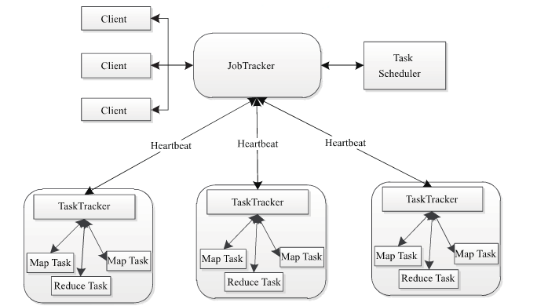
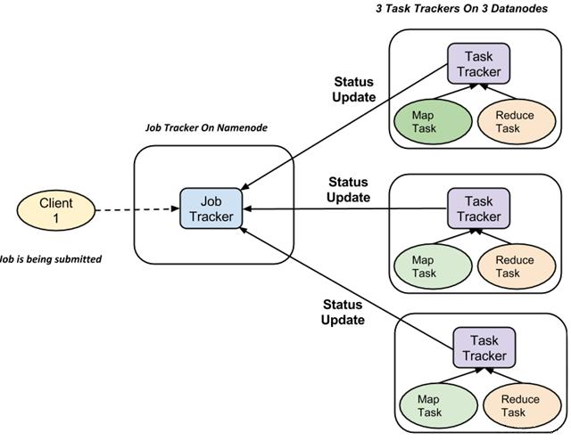
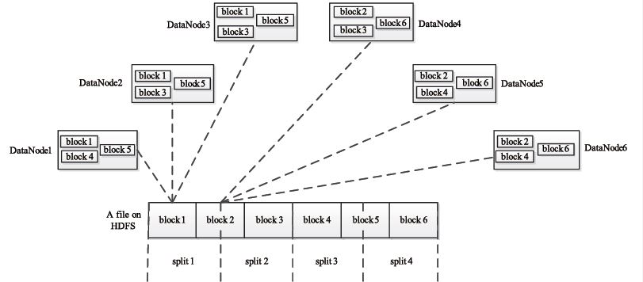

##### 是什么

```
MapReduce是一个分布式运算程序的编程框架, 核心功能是将用户编写的业务逻辑代码和自带默认组件整合成一个完整的分布式运算程序，并发运行在一个Hadoop集群上。分为map和reduce两个阶段。
	Map: 将一个Job分解为若干个task
	Recude: 完成分解的task，并且汇总结果。
```

##### 特点

```
优点
1）MapReduce 易于编程
它简单的实现一些接口，就可以完成一个分布式程序，这个分布式程序可以分布到大量廉价的PC机器上运行。也就是说你写一个分布式程序，跟写一个简单的串行程序是一模一样的。就是因为这个特点使得MapReduce编程变得非常流行。
2）良好的扩展性
当你的计算资源不能得到满足的时候，你可以通过简单的增加机器来扩展它的计算能力。
3）高容错性
MapReduce设计的初衷就是使程序能够部署在廉价的PC机器上，这就要求它具有很高的容错性。比如其中一台机器挂了，它可以把上面的计算任务转移到另外一个节点上运行，不至于这个任务运行失败，而且这个过程不需要人工参与，而完全是由Hadoop内部完成的。
4）适合PB级以上海量数据的离线处理
可以实现上千台服务器集群并发工作，提供数据处理能力。


缺点
1）不擅长实时计算
MapReduce无法像MySQL一样，在毫秒或者秒级内返回结果。
2）不擅长流式计算
流式计算的输入数据是动态的，而MapReduce的输入数据集是静态的，不能动态变化。这是因为MapReduce自身的设计特点决定了数据源必须是静态的。
3）不擅长DAG（有向图）计算
多个应用程序存在依赖关系，后一个应用程序的输入为前一个的输出。在这种情况下，MapReduce并不是不能做，而是使用后，每个MapReduce作业的输出结果都会写入到磁盘，会造成大量的磁盘IO，导致性能非常的低下。
```

## 组成

> MapReduce与hdfs一样使用master/slave结构



##### client

```
每一个Job都会在用户端通过Client类将应用程序以及参数配置Configuration打包成Jar文件存储在HDFS，并把路径提交到JobTracker的master服务，然后由master创建每一个Task（即MapTask和ReduceTask），将它们分发到各个TaskTracker服务中去执行
```

##### JobTracker

```
1. JobTracker负责资源监控和作业调度。JobTracker 监控所有的 TaskTracker 与job 的健康状况. 在任务失败的情况下，JobTracker 可以在不同的 TaskTracker 重新调度它。

2. JobTracker 会跟踪任务的执行进度，资源使用量等信息，并将这些信息告诉任务调度器，而调度器会在资源出现空闲时，选择合适的任务使用这些资源。
```

##### TaskTracker

```
1. 在分配的数据片段上执行Map或Reduce任务

2. TaskTracker 会周期性地通过 HeartBeat 将本节点上资源的使用情况和任务的运行进度汇报给JobTracker

3. 执行 JobTracker 发送过来的命令并执行相应的操作（如启动新任务，杀死任务等）。


---------------------
TaskTracker使用“slot”等量划分本节点上的资源量。“slot”代表计算资源（cpu，内存等） 。

一个Task获取到一个slot之后才有机会运行，而Hadoop调度器的作用就是将各个TaskTracker上的空闲slot分配给Task使用。

slot分为MapSlot和ReduceSlot两种，分别提供MapTask和ReduceTask使用。TaskTracker通过slot数目（可配置参数）限定Task的并发度。
```

##### JobTracker 和 TaskTracker 关系



```
1. 在执行任务时候 TaskTracker 可以有n多个, JobTracker 只有一个

2. 对于每一项工作提交执行在系统中，有一个 JobTracker 驻留在 Namenode 和 Datanode 驻留多个 TaskTracker
```

##### Task

```
Task分为MapTask和Reduce Task两种，均由TaskTracker启动。

HDFS以固定大小的block为基本单位存储数据，MapReduce其处理单位是split。

split是一个逻辑概念，它只包含一些元数据信息，比如数据起始位置、数据长度、数据所在节点等。它的划分方法完全由用户自己决定。

split的多少决定了MapTask的数目，因为每一个split只会交给一个MapTask处理。split与block的关系如下图： 
```



