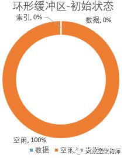
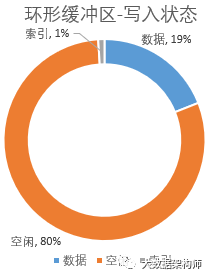
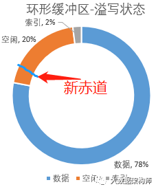

> https://blog.csdn.net/qq_42158942/article/details/100665384
>

##### 参考

```
https://www.niaogebiji.com/article-71858-1.html
```

##### 是什么

```
Map过程中环形缓冲区是指数据被map处理之后会先放入内存，内存中的这片区域就是环形缓冲区

环形缓冲区本质上就是一个逻辑上首尾相连的字节数组。
```

##### 作用和解决的问题

```
1. 环形缓冲区不需要重新申请新的内存，始终用的都是这个内存空间。大家知道MR是用java写的，而Java有一个最讨厌的机制就是Full GC。Full GC总是会出来捣乱，这个bug也非常隐蔽，发现了也不好处理。环形缓冲区从头到尾都在用那一个内存，不断重复利用，因此完美的规避了Full GC导致的各种问题，同时也规避了频繁申请内存引发的其他问题。

2. 环形缓冲区同时做了两件事情：1、排序；2、索引。在这里一次排序，将无序的数据变为有序，写磁盘的时候顺序写，读数据的时候顺序读，效率高非常多

3. 在这里设置索引区也是为了能够持续的处理任务。每读取一段数据，就往索引文件里也写一段，这样在排序的时候能加快速度。

4. 写入和写出可以同时进行
```

## 状态

##### 初始状态



```
1. 环形缓冲区分为三块，空闲区、数据区、索引区。
2. 初始位置取名叫做“赤道”，就是圆环上的白线那个位置。初始状态的时候，数据和索引都为0，所有空间都是空闲状态。
3. 使用 mapreduce.task.io.sort.mb 设置环形缓冲区的大小, 默认100M，可以稍微设置大一些，但不要太大，因为每个spilt就128M
```

##### 写入数据时



```
数据是从赤道的右边开始写入, 索引（每次申请4kb）是从赤道是左边开始写, 这样两个文件各是各的，互不干涉
```

##### 溢写状态



```
在数据和索引的大小到了 mapreduce.map.sort.spill.percent 参数设置的比例时, 默认80%, 会有两个动作：

1、对写入的数据进行原地排序，并把排序好的数据和索引spill到磁盘上去；
2、在空闲的20%区域中，重新算一个新的赤道，然后在新赤道的右边写入数据，左边写入索引；
3、当20%写满了，但是上一次80%的数据还没写到磁盘的时候，程序就会panding一下，等80%空间腾出来之后再继续写。

如此循环往复，永不停歇，直到所有任务全部结束。整个操作都在内存，形状像一个环，所以才叫环形缓冲区。
```

## 缓冲区写入数据过程

##### 什么时候写入

```
maptask 的结果会先输出到环形缓冲区中，即在 map() 方法中，调用一次 context.write() 就往环形缓冲区写出一次，所以 maptask 会频繁的进行写出操作，因为需要进行频繁写出操作，如果直接将 maptask 的输出结果直接写到磁盘当中，会频繁调用磁盘 IO，这会极大降低程序的效率，所以在 map 端的 suffle 过程中，maptask 的输出结果会先写到内存缓冲区中（即环形缓冲区），然后再由缓冲区积累到一定的数据后（默认数据达到总环形缓冲区大小的80%触发一次磁盘写入），统一调用一次磁盘 IO 去写入更多的数据。
```

##### 写入的数据是什么

```
环形缓冲区中存原始数据和原始数据的元数据, 都是key、value形式

原始数据的长度不是固定的

元数包含4个int组成:
    第一个int存放原始数据value的起始位置，
    第二个int存放原始数据key的起始位置，
    第三个int存放原始数据partition 分区信息 ，
    第四个int存放原始数据value的长度。

索引数据和元数据
```

```
1. 这个数据结构其实就是个字节数组，叫Kvbuffer
2. 放置了数据和索引数据. 放置索引数据的区域叫 Kvmeta
3. 数据区域和索引数据区域在Kvbuffer中是相邻不重叠的两个区域，用一个分界点来划分两者，分界点在每次Spill之后都会更新一次。初始的分界点是0
4. 数据的存储方向是向上增长，索引数据的存储方向是向下增长, Kvbuffer的存放指针bufindex是一直闷着头地向上增长，比如bufindex初始值为0，一个Int型的key写完之后，bufindex增长为4，一个Int型的value写完之后，bufindex增长为8。


索引是对在kvbuffer中的键值对的索引，是个四元组，包括：value的起始位置、key的起始位置、partition值、value的长度，占用四个Int长度，

Kvmeta的存放指针Kvindex每次都是向下跳四个“格子”，然后再向上一个格子一个格子地填充四元组的数据。比如Kvindex初始位置是-4，当第一个键值对写完之后，(Kvindex+0)的位置存放value的起始位置、(Kvindex+1)的位置存放key的起始位置、(Kvindex+2)的位置存放partition的值、(Kvindex+3)的位置存放value的长度，然后Kvindex跳到-8位置，等第二个键值对和索引写完之后，Kvindex跳到-12位置。
```

## 参数和属性

```
1、 kvbuffer :字节数组，数据和数据的索引都会存在该数组中
2、 kvmeta：只是kvbuffer中索引存储部分的一个视角，为什么这么说？因为索引往往是按整型存储（4个字节），所以使用kvmeta来重新组织该部分的字节（kvmeta中的一个单元相当于4个字节，但是kvmeta并没有重新开辟内存，其指向的还是kvbuffer）
3、 equator:(赤道)缓冲区的分割线，用来分割数据和数据的索引信息。
4、 kvindex:下次要插入的索引的位置
5、 kvstart:溢出时索引的起始位置
6、 kvend:溢出时索引的结束位置
7、 bufindex:下次要写入的raw数据的位置
8、 bufstart:溢出时raw数据的起始位置
9、 bufend:溢出时raw数据的结束位置
10、spiller:当数据占用超过这个比例时，就溢出
11、sortmb:kvbuffer总的内存量，默认值是100m，可以配置
12、indexCacheMemoryLimit:存放溢出文件信息的缓存大小，默认1m，可以配置
13、bufferremaining:buffer剩余空间，字节为单位
14、softLimit:溢出阈值，超出后就溢出。Sortmb*spiller
```


