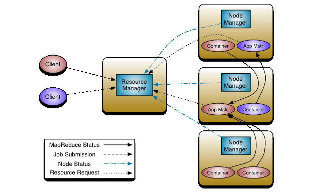

> 

##### 参考

```
```

##### 是什么

```
是hadoop集群资源管理器系统，Yarn从hadoop 2引入，最初是为了改善MapReduce的实现，但是它具有通用性，同样执行其他分布式计算模式
```

##### 解决什么问题

- 在MapReduce1中，具有如下局限性

  ```
  1、扩展性差：jobtracker兼顾资源管理和作业控制跟踪功能跟踪任务，启动失败或迟缓的任务，记录任务的执行状态，维护计数器），压力大，成为系统的瓶颈
  2、可靠性差：采用了master/slave结构，master容易单点故障
  3、资源利用率低：基于槽位的资源分配模型，槽位是一种粗粒度的资源划分单位，通常一个任务不会用完一个槽位的资源，hadoop1分为map slot和reduce slot，而它们之间资源不共享，造成一些资源空闲。
  4、不支持多框架：不支持多种计算框架并行
  ```

- yarn很好解决了MapReduce1中的局限性

  ```
  一个全局的资源管理器 resourcemanager 和与每个应用对用的 ApplicationMaster， Resourcemanager 和 NodeManager 组成全新的通用系统，以分布式的方式管理应用程序。
  
  yarn 特点：
      1、支持非mapreduce应用的需求
      2、可扩展性
      3、提高资源是用率
      4、用户敏捷性
      5、可以通过搭建为高可用
  ```

## 组件



- Yarn从整体上还是属于master/slave模型
- 有3个核心组件: ResourceManager, NodeManager, ApplicationMaster

##### ResourceManager

```
ResourceManager 拥有系统所有资源分配的决定权，负责集群中所有应用程序的资源分配，拥有集群资源主要、全局视图。

根据程序的需求，调度优先级以及可用资源情况，动态分配特定节点运行应用程序

ResourceManager主要有两个组件：Scheduler 和 ApplicationManager
```

##### Scheduler

```
Scheduler 是一个资源调度器，它主要负责协调集群中各个应用的资源分配，保障整个集群的运行效率。受到资源容量，队列以及其他因素的影响。
 

Scheduler 是一个纯粹的调度器，不负责应用程序的监控和状态追踪，不保证应用程序的失败或者硬件失败的情况对task重启，而是基于应用程序的资源需求执行其调度功能，使用了叫做资源 container 的概念


在 Hadoop 的 MapReduce 框架中主要有三种 Scheduler：
    FIFO Scheduler：先进先出，不考虑作业优先级和范围，适合低负载集群。
    Capacity Scheduler：将资源分为多个队列，允许共享集群，有保证每个队列最小资源的使用。
    Fair Scheduler：公平的将资源分给应用的方式，使得所有应用在平均情况下随着时间得到相同的资源份额。
```

##### ApplicationManager

```
主要负责接收job的提交请求，为应用分配第一个 Container 来运行 ApplicationMaster

负责监控 ApplicationMaster，在遇到失败时重启 ApplicationMaster 运行的 Container
```

##### Container

```
Container 是 Yarn 框架的计算单元，是具体执行应用task（如map task、reduce task）的基本单位。

Container和集群节点的关系是：一个节点会运行多个Container，但一个Container不会跨节点。

一个Container就是一组分配的系统资源，现阶段只包含两种系统资源（之后可能会增加磁盘、网络、GPU等资源），由NodeManager监控，Resourcemanager调度。

每一个应用程序从ApplicationMaster开始，它本身就是一个container（第0个），一旦启动，ApplicationMaster就会更加任务需求与Resourcemanager协商更多的container，在运行过程中，可以动态释放和申请container。
```

##### NodeManager

```
NodeManager 管理hadoop集群中独立的计算节点，主要负责与ResourceManager通信，负责启动和管理应用程序的 container 的生命周期，监控它们的资源使用情况（cpu和内存），跟踪节点的监控状态，管理日志等。并报告给RM。


NodeManager 在启动时，NodeManager 向 ResourceManager 注册，然后发送心跳包来等待 ResourceManager 的指令，主要目的是管理resourcemanager分配给它的应用程序container。NodeManager只负责管理自身的Container，它并不知道运行在它上面应用的信息。在运行期，通过 NodeManager 和 ResourceManager 协同工作，这些信息会不断被更新并保障整个集群发挥出最佳状态


主要职责：
    1、接收 ResourceManager 的请求，分配 Container 给应用的某个任务
    2、和ResourceManager交换信息以确保整个集群平稳运行。ResourceManager就是通过收集每个NodeManager的报告信息来追踪整个集群健康状态的，而NodeManager负责监控自身的健康状态。
    3、管理每个Container的生命周期
    4、管理每个节点上的日志
    5、执行Yarn上面应用的一些额外的服务，比如MapReduce的shuffle过程
```

##### ApplicationMaster

```
ApplicationMaster 负责与 scheduler 协商合适的 container，跟踪应用程序的状态，以及监控它们的进度，ApplicationMaster是协调集群中应用程序执行的进程。每个应用程序都有自己的ApplicationMaster，负责与ResourceManager协商资源（container）和NodeManager协同工作来执行和监控任务 。


当一个ApplicationMaster启动后，会周期性的向resourcemanager发送心跳报告来确认其健康和所需的资源情况，在建好的需求模型中，ApplicationMaster在发往resourcemanager中的心跳信息中封装偏好和限制，在随后的心跳中，ApplicationMaster会对收到集群中特定节点上绑定了一定的资源的container的租约，根据Resourcemanager发来的container，ApplicationMaster可以更新它的执行计划以适应资源不足或者过剩，container可以动态的分配和释放资源。
```

## yarn 作业调度流程


```
1、客户端程序向 ResourceManager 提交应用并请求一个 ApplicationMaster 实例，ResourceManager 在应答中给出一个 applicationID 以及有助于客户端请求资源的资源容量信息。

2、ResourceManager找到可以运行一个Container的NodeManager，并在这个Container中启动ApplicationMaster实例

Application Submission Context发出响应，其中包含有：ApplicationID，用户名，队列以及其他启动ApplicationMaster的信息，
Container Launch Context（CLC）也会发给ResourceManager，CLC提供了资源的需求，作业文件，安全令牌以及在节点启动ApplicationMaster所需要的其他信息。
当ResourceManager接收到客户端提交的上下文，就会给ApplicationMaster调度一个可用的container（通常称为container0）。然后ResourceManager就会联系NodeManager启动ApplicationMaster，并建立ApplicationMaster的RPC端口和用于跟踪的URL，用来监控应用程序的状态。

3、ApplicationMaster向ResourceManager进行注册，注册之后客户端就可以查询ResourceManager获得自己ApplicationMaster的详细信息，以后就可以和自己的ApplicationMaster直接交互了。在注册响应中，ResourceManager会发送关于集群最大和最小容量信息，

4、在平常的操作过程中，ApplicationMaster根据resource-request协议向ResourceManager发送resource-request请求，ResourceManager会根据调度策略尽可能最优的为ApplicationMaster分配container资源，作为资源请求的应答发个ApplicationMaster

5、当Container被成功分配之后，ApplicationMaster通过向NodeManager发送container-launch-specification信息来启动Container， container-launch-specification信息包含了能够让Container和ApplicationMaster交流所需要的资料，一旦container启动成功之后，ApplicationMaster就可以检查他们的状态，Resourcemanager不在参与程序的执行，只处理调度和监控其他资源，Resourcemanager可以命令NodeManager杀死container，

6、应用程序的代码在启动的Container中运行，并把运行的进度、状态等信息通过application-specific协议发送给ApplicationMaster，随着作业的执行，ApplicationMaster将心跳和进度信息发给ResourceManager，在这些心跳信息中，ApplicationMaster还可以请求和释放一些container。

7、在应用程序运行期间，提交应用的客户端主动和ApplicationMaster交流获得应用的运行状态、进度更新等信息，交流的协议也是application-specific协议

8、一但应用程序执行完成并且所有相关工作也已经完成，ApplicationMaster向ResourceManager取消注册然后关闭，用到所有的Container也归还给系统，当container被杀死或者回收，Resourcemanager都会通知NodeManager聚合日志并清理container专用的文件。
```


