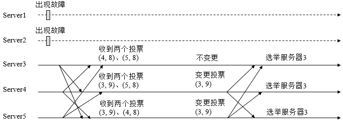

##### 参考

```
https://www.cnblogs.com/leesf456/p/6107600.html
```

##### 进行Leader选举条件

```
集群中的一台服务器出现以下两种情况之一时: 
    1. 服务器初始化启动。
    2. 服务器运行期间无法和Leader保持连接。
```

##### 进入Leader选举流程时集群状态

```
1. 集群中本来就已经存在一个Leader. 当该机器试图去选举Leader的时候，会被告知当前服务器的Leader信息，对于该机器来说，仅仅需要和Leader机器建立连接，并进行状态同步即可


2. 集群中确实不存在Leader, 进行Leader选举, 分为两种情况
	整个服务器刚刚初始化启动时，此时尚未产生一台Leader服务器
	在运行期间当前Leader所在的服务器挂了
```

##### 投票数据结构

```
id：被推举的Leader的SID。
zxid：被推举的Leader事务ID。
electionEpoch：逻辑时钟，用来判断多个投票是否在同一轮选举周期中，该值在服务端是一个自增序列，每次进入新一轮的投票后，都会对该值进行加1操作。
peerEpoch：被推举的Leader的epoch。
state：当前服务器的状态。
```

##### Leader 选举的算法

```
ZooKeeper的选举算法有两种：
	一种是基于Basic paxos实现的
	一种是基于Fast paxos算法实现的(系统默认)


从3.4.0版本开始，ZooKeeper废弃了0、1、2这三种Leader选举算法，只保留了TCP版本的FastLeaderElection选举算法。下文即仅对此算法进行介绍。
```

##### 初始化时选举 - FastLeaderElection

```
1. 若进行Leader选举，则至少需要两台机器

2. 在集群初始化阶段，当有一台服务器Server1启动时，其单独无法进行和完成Leader选举，当第二台服务器Server2启动时，此时两台机器可以相互通信，每台机器都试图找到Leader，于是进入Leader选举过程

3. 每个Server发出一个投票。由于是初始情况，Server1和Server2都会将自己作为Leader服务器来进行投票，每次投票会包含所推举的服务器的myid和ZXID，使用(myid, ZXID)来表示，此时Server1的投票为(1, 0)，Server2的投票为(2, 0)，然后各自将这个投票发给集群中其他机器

4. 集群的每个服务器收到各各服务器投票后，都需要将别人的投票和自己的投票进行比较, 规则如下
  - 先检查ZXID, ZXID比较大的服务器优先作为Leader
  - 如果ZXID相同, 则比较myid, myid较大的服务器作为Leader

5. 对于Server1而言，它的投票是(1, 0)，接收Server2的投票为(2, 0)，首先会比较两者的ZXID，均为0，再比较myid，此时Server2的myid最大，于是更新自己的投票为(2, 0)，然后重新投票，对于Server2而言，其无须更新自己的投票，只是再次向集群中所有机器发出上一次投票信息即可

6. 每次投票后，服务器都会统计投票信息，判断是否已经有过半机器接受到相同的投票信息，对于Server1、Server2而言，都统计出集群中已经有两台机器接受了(2, 0)的投票信息，此时便认为已经选出了Leader

7. 确定Leader后，每个服务器就会更新自己的状态，如果是Follower，那么就变更为FOLLOWING，如果是Leader，就变更为LEADING。
```

##### leader 挂掉后选举 - FastLeaderElection



```
0. 在 Zookeeper 运行期间, 有非Leader服务器宕机或新加入，此时也不会影响Leader. 当Leader服务器挂了，那么整个集群将暂停对外服务，进入新一轮Leader选举

0. 假定 Zookeeper 由5台机器组成，SID分别为1、2、3、4、5，ZXID分别为9、9、9、8、8，并且此时SID为2的机器是Leader机器，某一时刻，1、2所在机器出现故障，因此集群开始进行Leader选举。

1. 集群的所有机器都处于 LOOKING 状态，LOOKING 机器会向所有其他机器发送消息(投票)。

2. 假定用 (SID, ZXID)形式来标识一次投票信息

3. 在第一次投票时，每台机器都会将自己作为投票对象，于是SID为3、4、5的机器投票情况分别为(3, 9)，(4, 8)， (5, 8)。

4. 每台机器发出投票后，也会收到其他机器的投票，每台机器会根据上面的规则决定是否需要变更自己的投票

5. 更新自己的投票后, 再次投票

6. 每台机器都再次接收到其他机器的投票，统计投票. 如果一台机器收到了超过半数的相同投票，那么这个投票对应的SID机器即为Leader。此时Server3将成为Leader

7. 每个服务器就会更新自己的状态，如果是Follower，那么就变更为FOLLOWING，如果是Leader，就变更为LEADING
```


